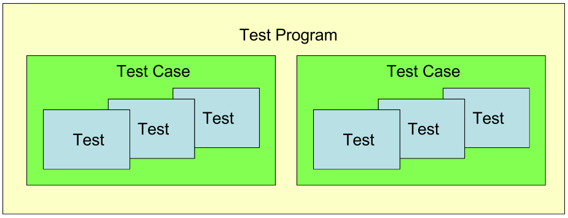
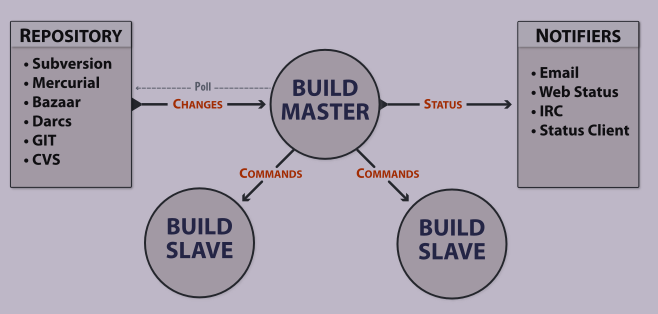
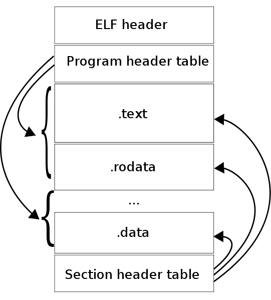
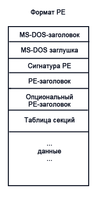
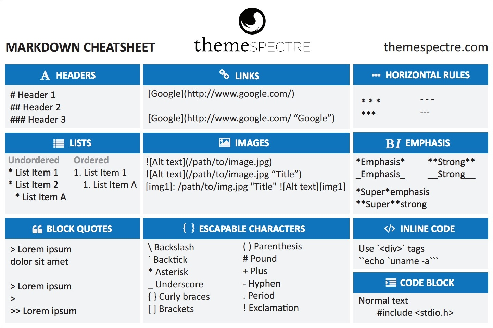
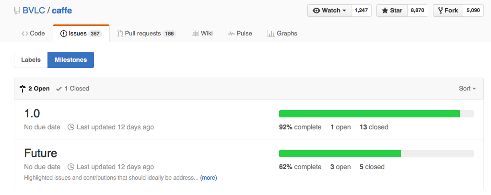
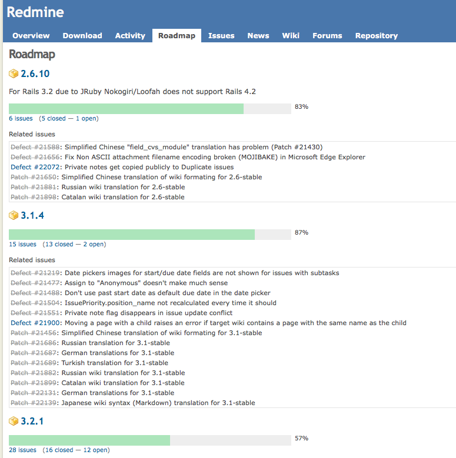

#### 1.1. Сравнительный анализ текстового и бинарного форматов.

**Преимущества простого текста:**

* Воспринимаемость человеком — просто понять структуру и содержание, часто без документации и специальных инструментальных средств.
* Простота — формат крайне удобен и его можно редактировать огромным количеством инструментов. И в первую очередь простым текстовым редактором.
* Версионируемость — файлы легко сравнивать, находить изменения.
* Переносимость — текстовый файл может быть прочитан на любой системе или ОС.
* Устойчивость — каждое слово и символ в таком файле самодостаточны и, если случится повреждение байтов в таком файле, то обычно можно восстановить данные или продолжить обработку остального содержимого.

**Преимущества бинарного формата:**

* Минимальный размер — не содержат "разметки", часто являются сжатыми.
* Машинное представление данных, иногда допускает прямую (а значит быструю) загрузку в оперативную память (например, сериализованные структуры данных). Нет необходимости в конверсии.
* Эффективность некоторых операций: поиск элементов, иногда вставка и удаление.

#### 1.2. Тестирование. Классификация тестов, критерии хорошего теста, инструменты.

**Классификация тестов:**

* По масштабу
  * Модульные (unit)
  * Интеграционные
    * Инфраструктурные
  * Системные
  * Приемочные (acceptance), функциональные
* По назначению
  * Функциональные требования
    * На задымление (smoke)
    * Регрессионные (regression)
    * На точность (accuracy)
    * Соответствие/совместимость (conformance/compliance)
    * Приемочные (acceptance)
    * Функциональные (functional)
  * Нефункциональные требования
    * На производительность (performance)
    * Стресс (stress)
    * Нагрузочные (load)
    * Качество кода (code quality)

**Критерии хорошего теста:**

1. Короткий (имеет чистый код)
2. Сфокусированный (только один assert)
3. Быстрый
4. Автоматический
5. Независим от порядка исполнения и окружения

Паттерн AAA: Arrange, Act, Assert

**Инструментарий:**

* **JUnit** — тестирование приложений для Java
* **TestNG** — тестирование приложений для Java
* **NUnit** — порт JUnit под .NET
* **Selenium** — тестирование приложений HTML;
* **TOSCA Testsuite** — тестирование приложений HTML, .NET, Java, SAP
* **UniTESK** — тестирование приложений на Java, Си.

**Ручное тестирование**

* Ключевые термины
  * Тест — проверка, осуществляемая "руками"
  * Тест-план — документ со списком проверок
  * Отдел тестирования (QA)
* Профессия ручного тестировщика вырождается!
  * За качество ответственность несут разработчики (пишут тесты!)
  * Google: Software Engineer in Test
* Ручное тестирование используется для:
  * Тестирования GUI и UX (удобства использования)
  * Бета-тестирование с реальными пользователями

**Автоматические тесты**

* Тест — это "обычная" функция, реализующая некоторый сценарий использования программных сущностей.
* Тестовая сборка (test suite) — приложение с тестами, обычно консольное.

**Необходимость автоматических тестов:**

* Тест пишется один раз, а запускается десятки тысяч раз!
* Развитие системы
* Коллективное владение
* Работа с legacy-кодом (сторонние контрибуции)
* Портирование ПО на новые платформы
* Тестирование новых платформ

**Современная стратегия тестирования**

* Без "зеленых" тестов нет уверенности в работоспособности кода
  * Фокус на максимальную автоматизацию
  * Полное тестирование требуется несколько раз в день, каждому члену команды
* Тесты пишутся самими разработчиками, одновременно с реализацией
  * Тесты это лучшая документация, которая всегда актуальна (компилятор!)
  * Тесты это первые сэмплы, показывающие простые примеры использования
  * Test-Driven Development
* Код тестируется непрерывно
  * Это делается локально на машине разработчика
  * Это делается на сервере до того, как добавить его в репозиторий
* Автоматические тесты замещают отладку
  * Предсказуемость времени разработки
  * Пойманный баг документируется в виде теста
* Тесты — это "first-class citizens"
  * Стоит отдавать код вместе с тестами
  * Нужно заботиться о качестве кода тестов
  * Метафора тестов: скелет, позволяющий организму двигаться

**Классификация тестов по назначению**

- Функциональные требования
  - **На задымление (smoke)**
    Smoke Test (англ. Smoke testing, дымовое тестирование) в тестировании означает минимальный набор тестов на явные ошибки. Дымовой тест обычно выполняется самим программистом; не проходящую этот тест программу не имеет смысла отдавать на более глубокое тестирование.
    Smoke test - быстрое и грубое тестирование кода сразу после внесения в него правок. П поводу происхождения термина 
  - **Регрессионные (regression)**
    Регрессионное тестирование - это вид тестирования, направленный на проверку изменений, сделанных в приложении или окружающей среде (починка дефекта, слияние кода, миграция на другую операционную систему, базу данных, веб сервер или сервер приложения), для подтверждения того факта, что существующая ранее функциональность работает как и прежде (см. также Санитарное тестирование или проверка согласованности/исправности).
  - **На точность (accuracy)**
  - **Соответствие/совместимость (conformance/compliance)**
  - **Приемочные (acceptance)**
    Приемочное тестирование или Приемо-сдаточное испытание (Acceptance Testing). Формальный процесс тестирования, который проверяет соответствие системы требованиям и проводится с целью:

    - Определения удовлетворяет ли система приемочным критериям;
    - Вынесения решения заказчиком или другим уполномоченным лицом принимается приложение или нет.

    Приемочное тестирование выполняется на основании набора типичных тестовых случаев и сценариев, разработанных на основании требований к данному приложению. 
    Решение о проведении приемочного тестирования принимается, когда:

    - Продукт достиг необходимого уровня качества;
    - Заказчик ознакомлен с Планом Приемочных Работ (Product Acceptance Plan) или иным документом, где описан набор действий, связанных с проведением приемочного тестирования, дата проведения, ответственные и т.д.
    - Фаза приемочного тестирования длится до тех пор, пока заказчик не выносит решение об отправлении приложения на доработку или выдаче приложения.
  - **Функциональные (functional)**
    Тесты, проверяющие функуиональные требования
- Нефункциональные требования
  - **На производительность (performance)**
    Тестирование, которое проводится с целью определения, как быстро работает вычислительная система или ее часть под определенной нагрузкой. Также может служить для проверки и подтверждения других атрибутов качества системы, таких как масштабируемость, надежность и потребление ресурсов.
  - **Стресс (stress)**
    Стресс-тестирование обычно используется для понимания пределов пропускной способности приложения. Этот тип тестирования проводится для определения надежности системы во время экстремальных или диспропорциональных нагрузок и отвечает на вопросы о достаточной производительности системы в случае, если текущая нагрузка сильно превысит ожидаемый максимум.
  - **Нагрузочные (load)**
    Нагрузочное тестирование — это простейшая форма тестирования производительности. Нагрузочное тестирование обычно проводится для того, чтобы оценить поведение приложения под заданной ожидаемой нагрузкой. Этой нагрузкой может быть, например, ожидаемое количество одновременно работающих пользователей приложения, совершающих заданное число транзакций за интервал времени. Такой тип тестирования обычно позволяет получить время отклика всех самых важных бизнес-транзакций. В случае наблюдения за базой данных, сервером приложений, сетью и т. д., этот тип тестирования может также идентифицировать некоторые узкие места приложения.
  - **Качество кода (code quality)**
    Скрипт, проверяющий код на GitHub в нашем репозитории

#### 2.1. Языки разметки (XML, YAML, JSON). Назначение, плюсы и минусы каждого из них.

**TXT:**

1. Документация (README, Changelog, TODO)
2. Логи (Отладочная информация, coredump)
3. Консольный вывод утилит (Разнообразные анализаторы)

Плюсы:

* Понятны человеку в своем исходном виде
* Версионируемость
* Кроссплатформенность
* Имеют упрощенный синтаксис
* Понятны человеку в своем исходном виде

Минусы:

* Нет разметки.

**XML:**

1. Отчеты различных утилит (результаты тестирования)
2. Сериализация структур данных (представление)
3. Конфигурационные файлы (в том числе для построения)

Плюсы:

* Это человеко-ориентированный формат документа, он понятен как человеку, так и компьютеру.
* Могут быть описаны основные структуры данных (записи, списки и деревья).
* Самодокументируемый формат, описывающий структуру и имена полей также как и значения полей.

Минусы:

* "Собственный язык".
* Синтаксис избыточен (размер XML документа существенно больше бинарного представления тех же данных, представления данных в других форматах, например, YAML, JSON).
* Пространства имен XML сложно использовать и их сложно реализовывать в XML парсерах.
* XML не содержит встроенной в язык поддержки типов данных. В нем нет понятий "целых чисел", "строк", "дат", "булевых значений" и т. д.

**YAML:**

1. Конфигурационные файлы
2. Сериализованные данные

Плюсы:

* Удобны для чтения и редактирования человеком.
* Занимают мало места.

Минусы:

* Для каждого языка приходится писать собственный парсер (для популярных языков уже написаны).
* Для каждого нового типа элемента приходится придумывать собственную синтаксическую конструкцию и реализовывать ее в парсере.
* Нельзя применять стандартные преобразования.
* Нельзя создавать составные документы.

**JSON:**

Плюсы:

* Сериализация структур, чаще всего в веб-приложениях (является подмножеством YAML)
* Сильно короче в записи, чем XML.

Минусы:

* Отсутствие широкой типизации. Есть только простые типы (строка/число/true/false/null) и объекты с массивами. Нет дат, разделения чисел на целые/дробные.
* Отсутствие стандартов записи объектов. Это, например, может привести к массивам со смешанными объектами внутри.
* Отсутствие ссылок. Если в JSON записывать иерархическую структуру объектов, то сделать ссылку на один и тот же объект из разных мест нельзя.

**Текст как исходник**

1. Все языки программирования используют текстовый формат как исходный. В том числе и ассемблер.
2. А некоторые языки, и как конечный формат распространения:
  * Скриптовые языки: bash, CMD
  * Динамические языки: Python, Perl, Ruby
  * Другие: JavaScript, MATLAB, GLSL, OpenCL (< v1.2?), CMake
3. Открытость исходника позволяет:
  * Читать и изучать
  * Модифицировать и переиспользовать
  * Генерировать

#### 2.2. Google Test. Назначение, возможности (и unit-testing фреймворков вообще), использование.

**Google Test**

1. Популярный фреймворк для написания модульных тестов на С++, разработанный Google.
2. Open-source проект c BSD-лицензией (допускает использование в закрытых коммерческих проектах).
3. Используется в целом ряде крупных проектов
  * Chromium, LLVM компилятор, OpenCV
4. Написан на C++, строится при помощи CMake
  * Поддерживает: Linux, Mac OS X, Windows, Cygwin, Windows CE и Symbian
5. Как правило используется в консольном режиме, но существует вспомогательное GUI приложение.

**Возможности Google Test**

* Automatic test discovery
* Rich set of assertions, user-defined assertions
* Death tests
* Fatal and non-fatal failures
* Value- and type-parameterized tests
* Various options for running the tests
* XML test report generation

Базовые концепции



* Каждый тест реализован как функция, с использованием макроса TEST() или TEST_F().
* TEST() не только определяет, но и "регистрирует" тест.

**Полезные советы**

* Тесты можно временно выключать
* Тесты можно фильтровать по имени при запуске

**Порядок использования Google Test**

* Начальная стадия
  1. Скомпилировать Google Test в библиотеку.
  2. Создать новое консольное приложение (test suite)\ и прилинковать к нему библиотеку Google Test.
  3. Добавить тесты.
  4. Скомпилировать приложение с тестами и запустить его.
* Основная стадия
  1. Новые тесты добавляются в тот же test suite, их могут быть тысячи.
  2. При необходимости test suite разбивается на несколько
  3. Корректность и производительность
  4. Быстрый (pre-commit) и полный (ночной)

#### 3.1. Инструменты для обработки текста в командной строке. Назначение, возможности, преимущества.

**Инструменты командной строки**

1. Просмотр
  * cat/tac, head/tail, less
2. Поиск
  * grep
3. Обработка
  * sed, awk

**Преимущества:**

1. Удобство
2. Возможность работы со скрытыми функциями

**Недостатки:**

1. Необходимо знание команд

**Grep**

Многоцелевая поисковая утилита, использующая регулярные выражения. Изначально это была команда в древнем строчном редакторе ed, g/re/p, что означает -- global - regular expression - print.

```
grep pattern [file...]
```

Поиск участков текста в файле(ах), соответствующих шаблону pattern, где pattern может быть как обычной строкой, так и регулярным выражением.

* `grep -nIHR "^#" --include=*.md ./`
  * Вывод всех заголовков в Markdown файлах ("| wc -l" добавит их подсчет)
* `grep -nIHR "class.*Matcher" --include=*.hpp -B1 ./`
  * Печать деклараций всех классов, содержащих слово Matcher (+одна строка до)

**Sed**

Stream editor - неинтерактивный "потоковый редактор". Широко используется в сценариях на языке командной оболочки.

* `sed 's/foo/bar/g'` — заменяет foo на bar
* `sed '/baz/s/foo/bar/g'` — то же самое, но если строка содержит baz
* `sed 's/[ \t]*$//'` — удалить "висячие" пробельные символы
* `sed '/regex/G'` — вставить пустую строку под каждой, содержащей "regex"
* `sed 'n;n;n;n;G;'` — вставить пустую строку через каждые 5
* `sed -n '$='` — посчитать количество строк
* `sed '1,10d'` — удалить первые 10 строк файла

**Awk**

Pattern-directed scanning and processing language - утилита контекстного поиска и преобразования текста, замечательный инструмент для извлечения и/или обработки полей (колонок) в структурированных текстовых файлах. Синтаксис awk напоминает язык C.

Примеры:

* `awk '{print NR "\t" $0}'` — распечатать файл с номерами строк
* `awk 'END{print NR}'` — вывести число строк в файле
* `awk '{print $2, $1}'` — распечатать второе и первое поле в обратном порядке
* `awk '{s=0; for (i=1; i<=NF; i++) s=s+$i; print s}'` — вывести сумму полей для каждой строки
* `awk '{sub(/[ \t]+$/, "")};1'` — удалить "висячие" пробельные символы
* `awk '{l=length();s=int((79-l)/2); printf "%"(s+l)"s\n",$0}'` — центрировать и распечатать файл

#### 3.2. Непрерывная интеграция. Назначение, преимущества, эволюция подходов, реализация.

>**Непрерывная интеграция** (англ. Continuous Integration) — это практика разработки ПО, которая заключается в выполнении частых автоматизированных сборок проекта для скорейшего выявления и решения интеграционных проблем.

Непрерывная сборка — это сердцебиение вашего проекта.

**Эволюция взглядов на интеграцию**

Можно условно представить в виде следующих практик:

1. Waterfall: разделить на компоненты, реализовать, интеграция — отдельная фаза
2. Nightly build: интегрироваться часто, ночной билд (heartbeet of the project)
3. Continuous Integration: интегрироваться непрерывно, тестирование каждого вливания
4. Pre-commit Testing: интегрироваться непрерывно, но после проверки стабильности
5. Continuous Deployment: развертываться непрерывно, сразу после проверки стабильности

На GitHub механизмом pull request реализуется Pre-Commit Testing, а механизмом push - Continuous Integration.

**Реализация**

Задачи выделенного сервера

1. Получение исходного кода из репозитория
2. Сборка проекта (в том числе построение дистрибутивов)
3. Выполнение тестов и автоматических проверок
4. Отправка отчетов (хранение истории и статистики)
5. Развертывание готового проекта

**Преимущества**

* Проблемы интеграции выявляются и исправляются быстро, что оказывается дешевле;
* Немедленный прогон модульных тестов для свежих изменений;
* Постоянное наличие текущей стабильной версии вместе с продуктами сборок — для тестирования, демонстрации, и т. п.
* Немедленный эффект от неполного или неработающего кода приучает разработчиков к работе в итеративном режиме с более коротким циклом.

**Автоматические проверки**

* Статический анализ
  1. Проверки на корректность
    * Максимальный уровень предупреждений компилятора (нескольких компиляторов!)
    * Автоматический поиск ошибок (PVS-Studio, cppcheck, Coverity Scan)
    * Соответстиве стандартам (стандарт ASIL - инструмент LDRA)
  2. Стиль кодирования (lint, vera++, cpplint.py)
    * Чистый код (именование, форматирование)
    * Анализ сложности кода
  3. Специальные инструменты
    * ABI compliance checker
    * Поиск IP проблем, например GPL кода ()
* Динамический анализ
  1. Анализ покрытия кода тестами (gcov, BullseyeCoverage)
  2. Утечки памяти, гонки данных (Valgrind, BoundsChecker)
  3. Анализ производительности (GoogleTest)
  4. Intel Parallel Studio

**Недостатки**

* Затраты на поддержку работы непрерывной интеграции;
* Потенциальная необходимость в выделенном сервере под нужды непрерывной интеграции;
* Немедленный эффект от неполного или неработающего кода отучает разработчиков от выполнения периодических резервных включений кода в репозиторий.
  * В случае использования системы контроля версий исходного кода с поддержкой ветвления, эта проблема может решаться созданием отдельной «ветки» (англ. branch) проекта для внесения крупных изменений (код, разработка которого до работоспособного варианта займет несколько дней, но желательно более частое резервное копирование в репозиторий). По окончании разработки и индивидуального тестирования такой ветки, она может быть объединена (англ. merge) с основным кодом или «стволом» (англ. trunk) проекта.

**Примеры систем**

1. Hudson > Jenkins
2. CruiseControl (CruiseControl.NET), TeamCity
3. Travis CI, AppVeyor, Drone.IO
4. BuildBot

#### 4.1. Регулярные выражения. Назначение, синтаксис, примеры реализаций и использования.

>**Регулярные выражения** (англ. regular expressions) — формальный язык поиска и осуществления манипуляций с подстроками в тексте, основанный на использовании метасимволов (англ. wildcard characters).

По сути это строка-образец (англ. pattern, по-русски ее часто называют «шаблоном», «маской»), состоящая из символов и метасимволов, и задающая правило поиска.

Метасимволы: `[ ] \ / ^ $ . | ? * + ( ) { }`

**Примеры регулярных выражений**

* `^\s*class\s*[a-zA-Z_]\w*` - простое объявление класса
* `^\s*class\s*[a-zA-Z_]\w*(\s*:\s*(public|protected|private)\s*[a-zA-Z_]\w*)?` – поиск полной декларации класса
* `[0-2][0-9]{3}\-(0[1-9]|1[0-2])\-(0[1-9]|[1-2][0-9]|3[0-1])` – дата в формате yyyy-mm-dd
* `(0[1-9]|[1-2][0-9]|3[0-1])\-(0[1-9]|1[012])\-[0-9]{2}` – dd-mm-yy
* `((25[0-5]|2[0-4][0-9]|1[0-9]{2}|[1-9]?[0-9])\.){3}(25[0-5]|2[0-4][0-9]|1[0-9]{2}|[1-9]?[0-9])` - IP адрес со всеми проверками
* `([0-9]{4}\ ){3}[0-9]{4}` - номер банковских карт
* `(0|[1-9A-F]?[0-9A-F]{1,7})` – HEX-представления чисел типа int (простое)
* `0[xX][0-9a-fA-F]{8}` - полное представление (используется для представления адресов в программах, работающих с бинарными файлами)

**Синтаксис**

* Обычные строки обозначают сами себя
* `.` — может быть использована вместо любого символа
* `\` — экранирует метасимволы (/ иногда используется как разделитель)
* `( )` — группировка, указывает приоритет операций
* `[ ]` — обозначает символьный класс ([abc], [0123456789], [а-я], [0-9])
* `^ $` — указывают на начало и конец строки
* `? * + { }` — указывают число повторений

**Назначение:**

Обычно с помощью регулярных выражений выполняются три действия:

* Проверка наличия соответствующей шаблону подстроки.
* Поиск и выдача пользователю соответствующих шаблону подстрок.
* Замена соответствующих шаблону подстрок.

#### 4.2. Сервера непрерывной интеграции. Задачи и примеры, сравнительный анализ систем.

**Задачи выделенного сервера**

1. Получение исходного кода из репозитория
2. Сборка проекта (в том числе построение дистрибутивов)
3. Выполнение тестов и автоматических проверок
4. Отправка отчетов (хранение истории и статистики)
5. Развертывание готового проекта



**BuildBot**

Преимущества:

1. Реализован на Python, как результат переносим и допускает кастомизацию (программирование билдеров)
2. Поддержка большого числа языков.

Недостатки:

1. Сложная настройка.

Особенности:

1. Система Buildbot использует архитектуру ведущих/ведомых серверов, которая предусматривает единственный центральный сервер и множество управляемых им серверов для сборки.
2. Удаленное исполнение команд осуществляется в полном соответствии со сценарием центрального сервера в реальном времени. 
3. Планирование выполнения команд и запросы сборки не только координируются, но и полностью контролируются центральным сервером.
4. Система Buildbot поддерживает постоянное соединение с каждой системой для сборки и осуществляет управление и координацию исполнения задач этими системами. Это постоянное соединение упрощает процессы координации и управления ресурсами.
5. В системе Buildbot предусмотрены блокировки для центрального и ведомых серверов на центральном сервере, поэтому могут координироваться как глобальные сборки в рамках всей системы, так и локальные сборки в рамках ресурсов отдельных машин. Это обстоятельство делает систему Buildbot в большей степени пригодной для больших систем, на которых проводятся тесты системной интеграции.
6. Каждый новый сервер для сборки должен быть явно задан при настройке центрального сервера, что делает невозможным динамическое подключение к центральному серверу новых серверов для сборки и их последующую эксплуатацию.
7. Каждый сервер для сборки находится под полным управлением центрального сервера, серверы сборки уязвимы для умышленных и случайных операций задания некорректных настроек: центральный сервер буквально осуществляет тотальный контроль клиента, контролируя также ограничения безопасности операционной системы клиента.
8. Другим последствием использования модели ведущих/ведомых серверов и ее ограниченного канала для взаимодействия является невозможность отправки отчетов о загрузке системы центральному серверу от ведомых серверов, поэтому центральный сервер не может избегать больших нагрузок на системы сборки.

**Travis СI**

Преимущества:

1. Интеграция с GitHub
2. Возможность бесплатного использования
3. Поддерживает большое количество языков
4. Тестирование происходит на виртуальных Linux-машинах, запускаемых в облаке Amazon

Недостатки:

1. Отсутствие проверки на Windows серверах

Настройка Travis:

1. Заходим на сайт сервиса, логинимся с помощью github аккаунта. Заходим в настройки профиля, и включаем репозиторий, на котором мы хотим гонять билды и тесты.
2. Большая часть настройки осуществляется в файле .travis.yml, который необходимо положить в корневую папку вашего репозитория. В процессе может пригодиться travis-lint, руби гем, позволяющий валидировать этот файл на корректность.
3. Настройка всех необходимых зависимостей для проекта. Имеются следующие шаги работы воркера Travis:
  * before_install
  * before_script
  * script
  * after_success / after_failure
  * after_script
4. Работа со скриптом, прогоняющим тесты.
5. Делаем коммит в одну из веток и пуш на github. Travis-CI автоматически запланирует билд, и через минуту-две начнет собирать проект. Если все пройдет успешно — статус станет зеленым, если нет — красным. Одновременно на почту отправится сообщение об успешности или неудаче сборки.

#### 5.1. СКВ. Основные функции и термины, базовые принципы.

**Системы контроля версий**

>**Системы контроля версий** — это программные системы, хранящие несколько версий одного документа, и позволяющие вернуться к более ранним версиям. Как правило, для каждого изменения запоминается дата модификации и автор.

>**Патч** (англ. patch — заплатка) — информация, предназначенная для автоматизированного внесения определенных изменений в компьютерные файлы.

* Патч — это простой текстовый файл, его можно наложить при помощи инструментов (patch).
* Один патч может содержать изменения сразу нескольких файлов в разных директориях.
* Люди могут обмениваться изменениями, посылая друг другу патчи.
* Патч — это атомарное изменение проекта!

Патчи и СКВ

* СКВ — это своего рода БД патчей, ее называют репозиторием.
* Патчи, помещенные в СКВ называются commit.
* Последовательности commit называются changeset.

**Поколения СКВ**

1. Локальные
  * Примеры: RCS, SCCS
  * Организация одновременной работы: locks
2. Централизованные
  * Примеры: Subversion, CVS
  * Организация одновременной работы: merge before commit
3. Распределенные
  * Примеры: Git, Mercurial
  * Организация одновременной работы: commit before merge

**Преимущества распределенных СКВ (DVCS)**

1. Допускают локальную работу (коммиты без наличия интернет)
2. Упрощают слияние (а значит параллельную разработку)
3. Дают максимальную свободу по организации рабочего процесса (workflow)


**Понятие ветки (branch)**

* Ветка в Git'е — это просто указатель на один из коммитов.
* Есть соглашение, что имя master используется для ветки, указывающей на последнее актуальное состояние проекта.

**HEAD**

* HEAD — специальный указатель, ссылающийся на локальную ветку, на которой вы находитесь.
* Это просто алиас (псевдоним) для текущей ветки, введенный для удобства.

**Резюме:**

1. Системы контроля версий — центральный инструмент разработки
  * Навигация по истории изменений
  * Централизованный доступ
2. Имеются и другие применения:
  * Конфигурации, документация, компьютерная анимация, САПР и др.
  * Появляется все больше примеров использования в других отраслях (книгоиздание, государственные документы).
3. Распределенные СКВ фактически стали стандартом. Их сильные стороны:
  * Допускают локальные коммиты (без наличия интернет или доступа к серверу)
  * Упрощают слияние (а значит параллельную разработку)
  * Дают максимальную свободу по организации рабочего процесса (workflow)
4. Git не самая простая в освоении СКВ, однако очень функциональная, к тому же дает максимальную свободу по организации процесса разработки.

#### 5.2. Понятие API, совместимости на уровне исходных кодов и бинарной, критерии и рекомендации.

>**API (Application Programming Interface)** - набор готовых классов, процедур, функций, структур и констант, предоставляемых ОС, приложением, библиотекой для использования во внешних программных продуктах.

- Все современные ОС предоставляют API;
- Все прикладные приложения явно или косвенно от него зависят;
- Необходимо поддерживать совместимость.

**Совместимости:**

- **Бинарная** - совместимость на уровне бинарных интерфейсов (ABI). Модуль можно заменить другим без потерь.
- **На уровне исходных кодов** (API, source). Замена библиотеки на другую не ломает компиляцию и логику программы.

**Способы реализации API:**
- Программные прерывания процессора;
- Динамическая компоновка и вызов библиотечных функции;
- Формирование пакетов данных соответствующих общим соглашениям.

**Бинарная совместимость в С++:**

1. Совпадают сигнатуры всех функций и методов;
2. Совпадает sizeof для всех экспортируемых объектов;
3. Совпадает состав всех структур, в том числе выравнивание;
4. Совпадают значения параметров по умолчанию;
5. Совпадают виртуальные методы, не добавляется новых виртуальных методов;
6. Совпадает иерархия виртуального наследования;
7. Могут отличаться имена констант, если они не экспортируются из библиотеки как символ;
8. Могут отличаться имена и структура макросов;
9. Могут быть добавлены новые невиртуальные методы;
10. Могут быть добавлены перегрузки функций, если функция уже была перегружена.

**Совместимость на уровне исходного кода в C++:**

1. Может отличаться число параметров функции, если определены значения по умолчанию для новых параметров;
2. Могут быть добавлены перегрузки методов;
3. Могут отличаться виртуальные методы;
4. Могут отличаться sizeof, выравнивание и поля структур;
5. Совпадают имена всех констант и макросов.

#### 6.1. Git (назначение, возможности, преимущества) и GitHub flow.

**Назначение:**

Git - распределенная СКВ (DVCS). Каждый имеет у себя локальную копию репозитария с сервера.

- Разработан Линусом Торвальдсом для работы над ядром Linux в 2005 году.
- В настоящее время поддерживается Джунио Хамано, сотрудником Google.
- Не очень прост в освоении, однако очень быстрый и функциональный.
- Имеет наиболее "сильное" сообщество, инструментальную поддержку.

**Преимущества:**

- Распределенная СКВ - можно коммитить столь часто, сколь угодно, даже если в данный момент отсутствует соединение с сервером.
- Работа с несколькими ветками.
- Удобный механизм слияния (merge).

**Интерфейс:**


**GutHub Flow:**

Anything in the `master` branch is deployable.

1. Create branch
  - To work on something new, create a descriptively named branch off of `master` (ie: `new-oauth2-scopes`).
2. Develop in branch
  - Commit to that branch locally and regularly push your work to the same named branch on the server.
3. Open a pull request (ask for review)
  - When you need feedback or help, or you think the branch is ready for merging, open a pull request.
4. Merge after review
  - After someone else has reviewed and signed off on the feature, you can merge it into `master`.
5. Deploy
  - Once it is merged and pushed to `master`, you can and *should* deploy immediately.

#### 6.2. Бинарные модули. Внутренняя структура ELF и PE модулей.

>**Исполняемый модуль** — файл, содержащий программу в виде, в котором она может быть после загрузки в память и настройки по месту) исполнена вычислительной машиной.

**ELF модуль на UNIX (1)**

ELF = Executable and Linkable Format



**ELF модуль на UNIX (2)**

1. Заголовок файла:
  - Архитектура аппаратной платформы;
  - Аппаратно зависимые флаги;
  - Точка входа
2. Таблица заголовков сегментов;
3. Данные сегментов и секций;
4. Таблица заголовков секций.

**ELF модуль на UNIX (3)**

**Сегмент** — это непрерывная область адресного пространства со своими атрибутами доступа. В частности, сегмент кода имеет атрибут исполнения, а сегмент данных — атрибуты чтения и записи.

**Секция** — фрагмент сегмента, имеющий определенное назначение:

- `.init` (процедуры инициализации);
- `.plt` (секция связок);
- `.text` (основой код программы);
- `.fini` (процедуры финализации).

Информация о сегментах используется при выполнении (Run-time).
Информация о секциях используются при динамической компоновке (Link-time).
Исполняемые файлы, `*.so`, `*.a`, `*.o` файлы используют ELF формат.

**PE Модуль на Windows (1)**

PE = Portable Executable



**PE Модуль на Windows (2)**

1. MS DOS часть для совместимости;
2. PE заголовок
  - Архитектура аппаратной платформы;
  - Аппаратно зависимые флаги;
  - Подсистема Windows (GUI, CUI, OS/2, Posix);
  - Точка входа;
  - Контрольная сумма;
3. Заголовки секций;
4. Данные секций.

**PE Модуль на Windows (3)**

- Исполняемые файлы `*.exe`, динамические библиотеки `*.dll` и драйверы используют
   PE формат;
- Формат несколько раз расширялся и некоторые функции могут быть реализованы
   по-разному;
- Не все инструменты одинаково интерпретируют/генерируют PE файлы;
- В PE  модуле есть отдельная секция ресурсов.

#### 7.1. Автоматизация. Преимущества, способы реализации, примеры.

**Преимущества:**

- Мощность / повышение уровня абстракции
  - Фокус на основной задаче
  - Меньшее количество переключений контекста
- Надежность
  - Отсутствие человеческого фактора
- Скорость
- Дешевизна
  - Особенно при многократном запуске
- Освобождение времени

**Типичные классы задач на автоматизацию (в работе программиста):**
- Слепая печать
- Сбор и обработка данных
  - Составление отчетов/графиков, анализ и обработка больших массивов данных
- Тестирование
  - Изменения ничего не сломали, анализ производительности
- Администрирование
  - Регулярные процедуры (бэкап), сложное конфигурирование
- Собственно, автоматизация
  - Построение дистрибутивов, развертывание

#### 7.2. Отладка. Назначение, методы, алгоритм "волчья ограда".

- **Отладка** - это процесс нахождения и устранения ошибок и дефектов в компьютерной программе или в электронном оборудовании.
- **Отладчик** - это компьютерная программа, которая используется для тестирования и отладки других программ.

**Общие определения:**

- **Breakpoint** (точка останова) - это преднамеренное прерывание выполнения программы, при котором выполняется вызов отладчика.
- **Watchpoint** - точка останова по данным. Срабатывает, когда меняется значение заданного выражения или переменной.
- **Catchpoint** - специальная точка останова, которая срабатывает при достижении специального события, например, C++ исключения или загрузки библиотеки.
- **Call stack** (стек вызовов) - хранит информацию об активных процедурах и функциях.

**Распространенные техники отладки**:

- Printf отладка, трассирование и логирование
- Post-mortem отладка (дамп памяти, логи)
- Использование специальных программ (отладчиков)
- Проверка различных утверждений в коде (assert)
- Алгоритм "волчья ограда"

**Edward Gauss - "Wolf fence" algorithm:**

"There's one wolf in Alaska, how do you find it? First build a fence down the middle of the state, wait for the wolf to howl, determine which side of the fence it is on. Repeat process on that side only, until you get to the point where you can see the wolf)."
In other words: put in a few "print" statements until you find the statement that is failing (then maybe work backwords from the "tracks" to find out where the wolf/bug comes from).

#### 8.1. Markdown. Назначение, синтаксис, примеры использования.

**Назначение:**

- Это язык разметки текстовой информации
- Имеет упрощенный синтаксис
- Ориентирован для редактирования из простого текстового редактора
- Понятен человеку в своем исходном виде

**Синтаксис:**



**Примеры использования:**

- GitHub: wiki and comments using GFM.
- StackOverflow: questions and answers editing.
- Askbot: the same as StackOverflow.
- Создание книг.
- Создание презентаций.
- Создание статических сайтов.

**Особенности использования:**

- Вероятно, самый популярный из легковесных языков разметки на сегодняшний день.
- Используется на StackOverflow и GitHub в качестве языка для wiki и комментариев.
- Поддерживается редакторами, оброс большим количеством инструментов.
- Минус: встречаются расхождения в "толковании". Но уже есть CommonMark!

#### 8.2. ИСР. Назначение, состав, возможности.

>**Интегрированная среда разработки**, ИСР (англ. IDE, Integrated development environment или integrated debugging environment) — система программных средств, используемая программистами для разработки программного обеспечения.

**Отличия ИСР от редакторов исходного кода:**

- Наличие компилятора
- Анализ кода
- Средства автоматизации сборки
- Наличие отладчика
- Наличие средств интеграции с СКВ
- Браузер классов
- Диаграмма иерархии классов
- Инспектор объектов

**Основные функции/возможности современных ИСР:**

- Автодополнение кода
- Поддержка шаблонов проектов
- Сниппеты
- Поддержка систем контроля версий
- Интеграция задач (//TODO: ...)
- Браузер классов
- Визульное редактирование классов
- Инструменты рефакторинга
- Профилировщик
- Работа с СУБД, веб-сервисами

#### 9.1. Текстовые редакторы. Возможности, сравнительный анализ популярных редакторов.

**Важные свойства редакторов:**

- Кросс-платформенность
- Настраиваемость
  - Шрифты, оформление, клавиатурные комбинации
- Расширяемость
  - Новые языки программирования и форматы файлов
- Программируемость
  - Программируемость сложных операций (макросы, сценарии)
- Скорость работы

**Возможности:**

- Навигация
  - По файлам
    - Перебор закладок
    - Боковая панель
    - Go to anything
  - Внутри файлов
    - Хождение по словам, строкам, экрану
    - Переход на строку
    - Переход между скобками
   - Go to symbol
- Выделение
  - Слов, Строк
  - Абзацев
  - Выражений внутри скобок
  - Всех вхождений слова => Поиск
- Поиск
  - Простой поиск
    - Multiple cursor
    - Регулярные выражения
  - Инкрементальный
  - Быстрый
- Редактирование
  - Комментирование
  - Перестановка двух символов
  - Удаление: слов, строк, окончаний строк
  - Манипуляции со строками
    - Дублирование, переупорядочение, сортировка
    - Слияние и автоматический перенос
  - Редактирование нескольких строк и прямоугольных регионов
- Продвинутые возможности
  - Package Control
  - Snippets
  - Vintage Mode
  - Custom Builds
  - Projects

**Vim** - свободный текстовый редактор, созданный на базе vi. Один из культовых редакторов. Один из мощнейших редакторов с полной свободой настройки и автоматизации. Имеет огромное количество расширений (более 3000). Используется практически в любых проектах.

**Примеры команд:**

- `5D`, `Y5p` - удалить/повторить строку 5 раз
- `/^joe` - найти все строки, начинающиеся с joe
- `:g!/REGEXP/d` - удалить все строки, не содержащие REGEXP
- `:%norm jdd` - удалить каждую вторую строку
- `ci(`, `ci[` - удалить содержимое внутри скобок
- `guu`, `gUU` - перевести всю строку в нижний/верхний регистр

**Emacs** - семейство расширяемых многофункциональных текстовых редакторов. Второй культовый редактор. Возможно, еще более мощный редактор, чем Vim (Emacs as OS). Имеет более 2000 встроенных команд, позволяет комбинировать их в макросы.

**Идеология Emacs:**
- "Все в одном"
  - Функциональность: базовая, основной режим, дополнительные режимы
- Расширяемость
  - Программируется на Elisp, имеются пакеты расширений, клавиатурные комбинации
- Настраиваемость под пользователя
  - Elisp-переменные, определение функций, создание hook'ов
- Документированность
  - Подробная документация, вплоть до функций и переменных

**Sublime Text** - кроссплатформенный редактор текста и кода. Имеет Python API, существует большое количество раширений. Не является свободным, однако почти все расширения открыты. Становится все более популярным.

Самый информативный - Vim (куча окошечек: несколько окон с исходным кодом, структура проекта, СКВ история, браузер классов, все открыто сразу).
Самый каноничный и олдскульный - Emacs.
Sublime Text - как Vim, только с интерфейсом, похожим на студию.

#### 9.2. Инструменты отладки. Отладочная информация, терминология, популярные команды GDB.

- **Отладка** - это процесс нахождения и устранения ошибок и дефектов в компьютерной программе или в электронном оборудовании.
- **Отладчик** - это компьютерная программа, которая используется для тестирования и отладки других программ.

**Общие определения:**

- **Breakpoint** (точка останова) - это преднамеренное прерывание выполнения программы, при котором выполняется вызов отладчика.
  **Примеры команд для GDB:** break, rbreak, tbreak
- **Watchpoint** - точка останова по данным. Срабатывает, когда меняется значение заданного выражения или переменной.
  **Примеры команд для GDB:** watch, rwatch, awatch
- **Catchpoint** - специальная точка останова, которая срабатывает при достижении специального события, например, C++ исключения или загрузки библиотеки.
- **Call stack** (стек вызовов) - хранит информацию об активных процедурах и функциях.
  **Примеры команд для GDB:** catch throw, catch catch, catch syscall, catch load.

**Распространенные техники отладки**:

- Printf отладка, трассирование и логирование
- Post-mortem отладка (дамп памяти, логи)
- Использование специальных программ (отладчиков)
- Проверка различных утверждений в коде (assert)
- Алгоритм "волчья ограда"

**Отладочная информация:**

Любой компилятор по умолчанию снабжает объектный файл отладочной информацией. Вся эта отладочная информация предназначается для отладки программы отладчиком. Отладочная информация может значительно увеличить объем файла (в 3-4 раза). Для создания программ "релизов" существует отдельная программа, позволяющая удалить отладочную информацию из запускаемого файла (например, strip).

**Полезные опции для GCC компилятора:**

- **`-g<level>`** - отладочная информация в нативном формате для операционной системы
  - level = 0 - нет отладочной информации
  - level = 1 - минимально необходимая информация
  - level = 3 - дополнительная информация
- **`-ggdb<level>`** - информация в формате GDB
- **`-O0`** - отключение всех оптимизаций компилятора
- **`-fno-omit-frame-pointer`** - использовать указатель на фрейм

**Запуск программ из под GDB:**

- **`$ gdb --args <программа с аргументами>`**
- **`$ gdb <программа> [<pid>] [<core-файл>]`**
- **`r, run [аргументы]`** - запуск программы под GDB
- **`start [аргументы]`** - удобный способ запуска программы с точкой останова на первой строчке функции `main`
- **`attach <pid> / detach`** - отладка уже запущенного процесса

**Продолжение и пошаговое исполнение:**

- **`continue, c, fg`** - возобновление исполнения программы
- **`s, step [count]`** - продолжить исполнение до следующей строчки исходного кода
- **`n, next [count]`** - продолжить исполнение до следующей строчки исходного кода в текущем фрейме
- **`ni, nexti, si, stepi [count]`** - так же как `next` и `step`, но для инструкции
- **`fin, finish`** - продолжить исполнение до тех пор, пока текущая функция не завершится
- **`u, until [location]`** - продолжить исполнение до тех пор, пока не достигнута следующая строчка

**Вывод информации о стеке вызовов:**

- **`bt, backtrace [full] [n]`** - напечатать стек вызовов
- **`frame [n]`** - навигация по текущему стеку вызовов
- **`info frame`** - вывести подробную информацию о текущем стековом фрейме
- **`info args`** - вывести аргументы для текущего фрейма
- **`info locals`** - вывести локальные переменные для текущего фрейма

**Просмотр данных:**

- **`print [/fmt] <expr>`** - показать значение выражения
  - a - указатель
  - x - шестнадцатеричное целое
  - s - трактовать как C-строку
  - u - беззнаковое целое
- **`print *address@<len>`** - показать массив
- **`display [/fmt] <expr>`** - показывать каждый раз
- **`delete/disable/enable display <id>`** - управлять списком для отображения данных
- **`info display`** - вывести список выражений для отображения
- **`info <registers | all-registers>`** - показать регистры

**Навигация по исходным файлам:**

- **`l, list [linenum | function | - | +]`** - показать код
- **`forward-search, search regexp`** - искать в прямом направлении в текущем файле
- **`reverse-search regexp`** - искать в обратном направлении в текущем файле
- **`dir, directory <dirname>`** - добавить директории для поиска файлов
- **`set substitute-path <to> <from>`** - определить подстановочное правило для директории
- **`disassemble [/m | /r] [start,+length]`** - показать диапазон памяти, как инструкции процессора

**Исполнение в обратном направлении:**

- **`record [full]`** - начать процесс записи
- **`record stop`** - остановить процесс записи
- **`reverse-continue, reverse-step, reverse-next, reverse-nexti,`**
  **`reverse-stepi, reverse-finish`** - команды для обратного исполнения программы
- **`checkpoint`** - сделать снимок состояния программы
- **`restart <checkpoint-id>`** - восстановить состояние
- **`info checkpoints`** - информация о всех checkpoints
- **`delete checkpoint <id>`** - удалить checkpoint

**Текстовый пользовательский интерфейс:**

- Запустить `gdb -tui` и **C-x C-a** сочетание клавиш
- В TUI режиме, gdb может отображать несколько окон:
  - command - GDB командная строка и вывод
  - source - показывает исходный код программы
  - assembly - показывает вывод дизассемблера
  - register - показывает регистры процессора
- `layout <prev | next | asm | src | split | regs>`
- `focus <prev | next | asm | src | split | regs | cmd>`
- `refresh` (или **C-L** сочетание клавиш)

#### 10.1. История развития билд-систем (от shell до CMake и IDE).

##### Shell-скрипт

Программа, выполняемая командной оболочкой операционной системы. Пишется скрипт, в котором указываются команды сборки файлов программы.

Плюсы:
- Не нужно компилировать
- Присутствует на различных платформах (Linux - .sh, Windows - .bat)
- Нужно знать только команды консоли

Минусы:
- Не запрограммируешь сложную логику сборки

##### Make (1977)

Утилита, автоматизирующая процесс преобразования файлов из одной формы в другую. Чаще всего это компиляция исходного кода в объектные файлы и последующая компоновка в исполняемые файлы или библиотеки.

Программа make выполняет команды согласно правилам, указанным в Makefile.

Синтаксис Makefile:
```
цель1 цель2 ...: реквизит1 реквизит2 ...
        команда1
        команда2
        ...
```

Пример Makefile:
```
program: main.o lib.o
        cc -o program main.o lib.o
```

##### Autotools

Это набор программных средств, предназначенных для поддержки переносимости исходного кода программ между UNIX-подобными системами. Включает в себя Autoconf, Automake и др.

- **Makefile.am** - Automake читает эти файлы и создает переносимый Makefile.am, которые после обработки скриптом конфигурации становится Makefile и используется make
- **Configure.ac** - Autoconf читает эти файлы и генерирует скрипт настройки configure. Скрипт запускается пользователем. Он читает файлы с расширением .in, обрабатывает их и в конечном результате получает Makefile.

Плюсы:

- Был де-факто стандартом и до сих пор используется

Минусы:

- Сложный
- Только Unix
- Зависимости

##### Cmake

Это кроссплатформенная система автоматизации сборки программного обеспечения из исходного кода. CMake не занимается непосредственно сборкой, a лишь генерирует файлы управления сборкой из файлов CMakeLists.txt

Плюсы:

- Удобен после непродолжительного обучения
- Дает членам команды максимальную свободу в выборе инструментов (OC, IDE или простой текстовый редактор)
- Обеспечивает переносимость и является стандартом де-факто для кроссплатформенных С++ проектов

Минусы:

- "Собственный" язык
- Поначалу кажется нетривиальным

##### IDE

> __Интегрированная среда разработки, ИСР__ (англ. __IDE, Integrated development environment__ или __integrated debugging environment__) — система программных средств, используемая программистами для разработки программного обеспечения.

**Функции современных IDE**

- Автодополнение кода
- Поддержка шаблонов проектов
- Сниппеты
- Поддержка систем контроля версий
- Интеграция задач (`//TODO: ...`)
- Браузер классов
- Визульное редактирование классов
- Инструменты рефакторинга
- Профилировщик
- Работа с СУБД, веб-сервисами

#### 10.2. UNIX. Философия и преимущества при автоматизации.

This is the Unix philosophy:

- Write programs that do one thing and do it well.
- Write programs to work together.
- Write programs to handle text streams, because that is a universal interface.

##### Преимущества автоматизации

- Мощность / повышение уровня абстракции
  - Фокус на основной задаче
  - Меньшее количество переключений контекста
- Надежность
  - Отсутствие человеческого фактора
- Скорость
- Дешевизна
  - Особенно при многократном запуске
- Освобождение времени

##### Классы задач на автоматизацию

- Сбор и обработка данных
  - Составление отчетов/графиков, анализ и обработка больших массивов данных
- Тестирование
  - Изменения ничего не сломали, анализ производительности
- Администрирование
  - Регулярные процедуры (бэкап), сложное конфигурирование
- Собственно автоматизация
  - Построение дистрибутивов, развертывание

##### Преимущества Unix при автоматизации

- Огромное количество утилит на любой случай жизни
  - find, cron, tar, sed, etc.
- Вместе со скриптовыми языками (Bash, Perl, Python, etc) предоставляет широчайшие возможности для автоматизации

#### 11.1. Различные рабочие процессы в Git (workflow). Назначение, плюсы и минусы каждого из вариантов.

__Centralized Workflow__


Плюсы
+ Простота организации
+ Хранение репозитория в одном месте

Минусы
+ Нет проверки на качество вносимых изменений
+ При одновременной работе необходимо производить merge изменений

__Integration Manager Workflow__


Плюсы
+ Каждый разработчик может работать в своем темпе, а интеграционный менеджер забирать изменения и вносить их в проект в любое время
+ Интеграционный менеджер проверяет качество вносимых изменений
+ Клонирование репозиториев для каждого разработчика (`public developer`)

Минусы
+ Принцип организации сложнее и затраты на него больше, чем в Centralized
+ Нагрузка на интеграционного менеджера растет при увеличении числа разработчиков

__Dictator and Lieutenants Workflow__


Плюсы
+ Нагрузка между lietenants распределена равномерно (каждый отвечает за свой модуль/направление)

Минусы
+ Длительный процесс внесения изменений

__Git Flow__


#### 11.2. Статическая и динамическая компоновка. Сравнительный анализ.

Компоновка (связывание)

- Вход: объектные файлы, статические и динамические библиотеки;
- Выход:
  - статическая библиотека или динамическая библиотека или исполняемая программа
  - отладочная информация.

Статическая компоновка

- Компоновка исполняемого модуля на этапе компиляции;
- Все функции находятся внутри выполняемого модуля;
- Все адреса переменных и функций определяются на этапе компиляции;
- "Нет зависимости" от других библиотек.

Динамическая компоновка

- Компоновка исполняемого модуля во время исполнения;
- Библиотечные функции находятся в других модулях;
- Связывание происходит во время выполнения путем заполнения таблиц адресов;
- Явная зависимость от других библиотек.

#### 12.1. СКВ. Определение, назначение, история развития (преимущества DVCS).

>__Системы контроля версий__ — это программные системы, хранящие несколько версий одного документа, и позволяющие вернуться к более ранним версиям. Как правило, для каждого изменения запоминается дата модификации и автор.

История развития:

1. Локальные

  

  - Примеры: RCS, SCCS
  - Организация одновременной работы: locks
2. Централизованные

  

  - Примеры: Subversion, CVS
  - Организация одновременной работы: merge before commit
3. Распределенные

  

  - Примеры: Git, Mercurial
  - Организация одновременной работы: commit before merge

Назначение:

- Системы контроля версий — центральный инструмент разработки
 - Навигация по истории изменений
 - Централизованный доступ
- Имеются и другие применения:
 - Конфигурации, документация, компьютерная анимация, САПР и др.
 - Появляется все больше примеров использования в других отраслях (книгоиздание? государственные документы)

Распределенные СКВ фактически стали стандартом. Их сильные стороны:

- Допускают локальные коммиты (без наличия интернет или доступа к серверу)
- Упрощают слияние (а значит параллельную разработку)
- Дают максимальную свободу по организации рабочего процесса (workflow)

#### 12.2. CMake. Назначение, возможности, плюсы и минусы.

Это кроссплатформенная система автоматизации сборки программного обеспечения из исходного кода. CMake не занимается непосредственно сборкой, a лишь генерирует файлы управления сборкой из файлов CMakeLists.txt

Плюсы:

- Удобен после непродолжительного обучения
- Дает членам команды максимальную свободу в выборе инструментов (OC, IDE или простой текстовый редактор)
- Обеспечивает переносимость и является стандартом де-факто для кроссплатформенных С++ проектов

Минусы:

- "Собственный" язык
- Поначалу кажется нетривиальным

__Возможности:__

**Указание необходимой версии cmake.**

Писать эту команду всегда - хороший стиль
```
cmake_minimum_required(VERSION 2.6)
```
**Название проекта.**

Указывает, что этот cmake-файл является корневым для некоторого проекта.
```
project(visualization)
```
**Adding a Directory to your Header Search Paths**

To add a header search path, use the `include_directories` command. For example:
```
include_directories( ../external/boost/ )
```
**Adding a Directory to your Library Search Paths**

Same syntax as above, but use the `link_directories` command instead:
```
link_directories( ../external/libcinder/libs/ )
```
**Linking To Third-Party Libraries**

To link to a third-party library, you first need to add the library to your project as if it were a library you are building yourself. You can do this with the `add_library` command:
```
add_library( libcinder STATIC IMPORTED )
```
The third argument is the most important here - it tells CMake that this library is pre-built, and that there are therefore no sources to specify.

Once you’ve defined the library, you then have to tell CMake where the prebuilt library is located. This can be done by setting the `IMPORTED_LOCATION` property on your new library:
```
set_property( TARGET libcinder PROPERTY IMPORTED_LOCATION libcinder.a )
```
Now that you have defined your library, you can then have your executable target it by using the `target_link_libraries` command:
```
add_executable( AwesomeDemo ${ SOURCE_FILES } )
target_link_libraries( AwesomeDemo libcinder )
```
**Specifying Different Debug and Release Libraries**

Is is pretty likely that your third-party vendor has supplied different debug and release builds of their libraries. Here is an example of how to express this in CMake:
```
add_library( libcinder_d STATIC IMPORTED )
add_library( libcinder STATIC IMPORTED )

set_property( TARGET libcinder_d PROPERTY IMPORTED_LOCATION libcinder_d.a )
set_property( TARGET libcinder PROPERTY IMPORTED_LOCATION libcinder.a )

add_executable( AwesomeDemo ${ SOURCE_FILES } )
target_link_libraries( AwesomeDemo debug libcinder_d optimized libcinder )
```
What we’ve basically done here is define both external libraries. Then, when calling the `target_link_libraries` command we can use the `debug` and `optimized` keywords to specify the two versions accordingly.

**How To Access Environment Variables**

Environment variables can be accessed via the ENV CMake variable, for example:
```
include_directories( $ENV{ MAYA_PATH }/devkit/include )
```
**How to detect Apple, Windows, and Linux**

If you need to add platform specific commands to your CMakeLists then you can use the following syntax:
```
IF (APPLE)
    # Add your apple commands here
ENDIF ( )

IF (WIN32)
    # Add your windows commands here
ENDIF ( )

IF (UNIX)
    # Add your unix commands here
ENDIF ( )
```
**Переменные**
```
set(VARIABLE The variable's value)
```
**Команды компилятору**
```
set(CMAKE_CXX_FLAGS "${CMAKE_CXX_FLAGS} -std=c++11 -Wall")
```

#### 13.1. Современная стратегия тестирования (включая распределение ролей и инструментальную поддержку).

- Без "зеленых" тестов нет уверенности в работоспособности кода
  - Фокус на максимальную автоматизацию
  - Полное тестирование требуется несколько раз в день, каждому члену команды
- Тесты пишутся самими разработчиками, одновременно с реализацией
  - Тесты это лучшая документация, которая всегда актуальна (компилятор!)
  - Тесты это первые сэмплы, показывающие простые примеры использования
  - Test-Driven Development
- Код тестируется непрерывно
  - Это делается локально на машине разработчика
  - Это делается на сервере до того, как добавить его в репозиторий
- Автоматические тесты замещают отладку
  - Предсказуемость времени разработки
  - Пойманный баг документируется в виде теста
- Тесты — это "first-class citizens"
  - Стоит отдавать код вместе с тестами
  - Нужно заботиться о качестве кода тестов
  - Метафора тестов: скелет, позволяющий организму двигаться

Возможности фреймворков модульного тестирования:

1. Удобное добавление тестов
  - Простая регистрация новых тестов
  - Набор функций-проверок (`assert`)
  - Общие инициализации и деинициализации
2. Удобный запуск тестов
  - Пакетный режим
  - Возможность фильтрации тестов по именам
3. Часто допускают интеграцию с IDE
4. Генерация отчета в стандартном XML-формате
  - Возможность последующего автоматического анализа
  - Публикация на web-страницах проекта

#### 13.2. Учет и планирование задач

**Категории задач**

- Дефекты (bugs)
  - Дефекты (bugs) нужно делить на критические и некритические.
  - В наличии некритических нет ничего критического.
  - Критических ошибок быть не должно вообще! Их исправляем в первую очередь.
- Новые функциональные возможности (features)
  - Новые возможности
  - Функции стоит реализовывать в порядке приоритета.
  - Редко когда имеет смысл откладывать релиз из-за того, что не все новые функции добавлены.
- Иногда можно добавить еще просто задачи (tasks)

**Простые истины**

- Законченных приложений не бывает, бывают только "мертвые"
- Приложений без ошибок не существует, вопрос в их количестве и критичности
- Пожеланий (feature request) всегда будет слишком много
- Времени никогда не хватает, вопрос в эффективном его использовании
- Про задачи полезно думать как про молекулы "жидкости" (вспоминаем коммиты)
- Про приложение полезно думать не про что-то жесткое, а как про растущий организм, постоянно изменяющий свой облик
- Выигрывает тот, кто сумеет организовать постоянную и быструю эволюцию своего приложения (адаптация к изменяющимся условиям)

**Механизмы для учета задач:**

**GitHub Milestones**



**Redmine Roadmap**


